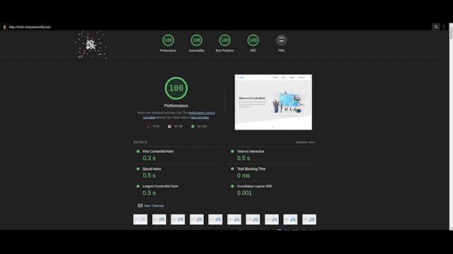

# Code Company Website

## Live Website

💻 Check the live website from [here](https://belal-aljumaa.github.io/code_company/)

## Design Previews

| [🖥️ Desktop Preview](.github/Code-Company-Desktop.png) | [📱 Mobile Preview](.github/Code-Company-Mobile.png) |
| -------------------------------------------------- | ----------------------------------------------- |

## Lighthouse Results

## Implemented Features

- ⭐ Single Page Website
- 🤖 Responsive layout on ALL devices
- ⚡ Fast and lightweight website; based on Lighthouse report
- ✨ And more!

## Used Technologies

<table>
  <tr>
    <td>
      
    </td>
    <td>
      
    </td>
    <td>
      
    </td>
    <td>
      
    </td>
  </tr>
</table>

## Credits & Assets

- Website Image Preview Template is from [ElZero Web School](https://elzero.org/)
- Images are from [Unsplash](https://unsplash.com/)
- Font Icons are from [Font Awesome](https://fontawesome.com/)
- Fonts are from [Google Fonts](https://fonts.google.com/)